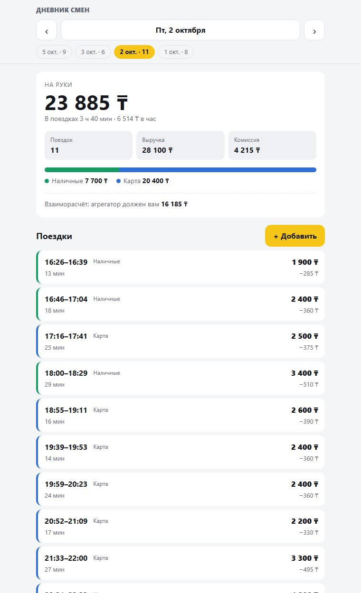

# Дневник смен водителя

Сервер с API и веб-клиент: сводка за день, список поездок, переключение дней, добавление поездки
с проверкой данных и защитой от дублей. Написан на Node.js **без внешних зависимостей** —
ни `npm install`, ни базы данных не нужно.



## Быстрый старт

Нужен Node.js 20 или новее.

```bash
npm start      # http://localhost:3000
npm test       # 45 тестов
```

При первом запуске рабочий файл `data/trips.json` создаётся из примера `data/trips.sample.json`
(34 поездки за 1, 2, 3 и 5 октября 2026, включая поездки из задания).

Переменные окружения (все необязательные):

| Переменная     | По умолчанию        | Что задаёт                         |
| -------------- | ------------------- | ---------------------------------- |
| `PORT`         | `3000`              | Порт сервера                       |
| `APP_TIMEZONE` | `Asia/Almaty`       | Часовой пояс, по которому режутся дни |
| `DATA_FILE`    | `data/trips.json`   | Файл с поездками                   |

## Что сделано по заданию

1. **Сервер отдаёт поездки и сводку за день** — `GET /api/days/:date`: число поездок, выручка,
   комиссия, «на руки», разбивка наличные/карта. Плюс время в поездках и взаиморасчёт с агрегатором.
2. **Клиент** (`public/`) показывает сводку и список, переключает дни стрелками, выбором даты,
   чипами «дни с поездками» и клавишами ← →. Ссылка на день сохраняется в адресе (`/#2026-10-02`).
   Вёрстка рассчитана на телефон, есть светлая и тёмная тема.
3. **Добавление поездки** — `POST /api/trips` с проверкой: сумма > 0, окончание позже начала
   и остальные поля (см. ниже). Повторная отправка той же поездки дубль не создаёт.
4. **Тесты** — `node:test`, 45 штук: расчёт сводки, валидация, защита от дублей
   (включая 10 одновременных одинаковых запросов), API целиком через HTTP.

## API

| Метод и путь                    | Ответ                                                    |
| ------------------------------- | -------------------------------------------------------- |
| `GET /api/days/:date`           | `{ date, summary, trips }` за день `YYYY-MM-DD`          |
| `GET /api/days/:date/trips`     | `{ date, trips }`                                        |
| `GET /api/days/:date/summary`   | `{ date, summary }`                                      |
| `GET /api/days`                 | Дни, в которых есть поездки, от новых к старым           |
| `POST /api/trips`               | Добавить поездку                                         |
| `GET /api/config`               | Часовой пояс сервиса и его смещение                      |
| `GET /api/health`               | Проверка, что сервер жив                                 |

Пример сводки (`GET /api/days/2026-10-01/summary`, только две поездки из задания):

```json
{
  "trips": 2,
  "revenue": 3900,
  "commission": 585,
  "net": 3315,
  "byPayment": {
    "cash": { "trips": 1, "amount": 1500, "commission": 225, "net": 1275 },
    "card": { "trips": 1, "amount": 2400, "commission": 360, "net": 2040 }
  },
  "settlement": 1815,
  "onTripMinutes": 37
}
```

Добавление поездки:

```bash
curl -X POST http://localhost:3000/api/trips \
  -H "Content-Type: application/json" \
  -d '{"id":"t100","start":"2026-10-05T14:00:00+05:00","end":"2026-10-05T14:20:00+05:00","amount":2000,"payment":"cash","commission":300}'
```

| Код | Когда                                                                 |
| --- | --------------------------------------------------------------------- |
| 201 | Поездка создана                                                       |
| 200 | Такая поездка уже есть — возвращается сохранённая, дубль не создаётся |
| 422 | Данные не прошли проверку; в `error.details` — ошибки по каждому полю |
| 409 | `id_conflict` — id занят другой поездкой; `overlap` — время пересекается с другой поездкой |
| 400 | Битый JSON или неверная дата в адресе                                 |
| 415 | Нет `Content-Type: application/json`                                  |

## Решения и допущения

**Защита от дублей.** Ключ идемпотентности — `id` поездки:
- тот же `id` и те же данные → `200`, возвращается уже сохранённая поездка;
- тот же `id`, другие данные → `409 id_conflict`, старая запись не меняется;
- поездка без `id` → `id` вычисляется хешем от содержимого, так что повтор тоже не создаёт дубль;
- время сравнивается как момент, а не как строка: `08:10+05:00` и `03:10Z` — одна и та же поездка.

Дополнительно поездка не может **пересекаться по времени** с другой (`409 overlap`): один водитель
не везёт двух пассажиров сразу. Это ловит дубли, пришедшие с разными `id`, например после
перезапуска клиента. Поездки встык (одна кончилась в 08:32, следующая началась в 08:32) разрешены.

Клиент генерирует `id` при открытии формы и сохраняет его до успешного ответа: если запрос упал
по сети, повторное нажатие «Сохранить» не создаст вторую поездку.

**Проверка данных.**
- `start`, `end` — ISO 8601 **с обязательным часовым поясом**. Строка без пояса неоднозначна, её не принимаем.
  Несуществующие даты (`2026-02-30`) отклоняются: стандартный `Date.parse` молча превратил бы их в 2 марта.
- `end` позже `start`, поездка не длиннее 24 часов.
- `amount` — целое число тенге > 0; `commission` — целое от 0 до `amount`.
  Деньги — целые числа, без дробей, чтобы не было ошибок округления.
- `payment` — `cash` или `card`.
- Возвращаются все ошибки сразу, а не только первая.

**День поездки** определяется по времени **начала** в часовом поясе сервиса (`Asia/Almaty`).
Поездка 23:40–00:05 относится к дню, когда началась. Время 00:30 по Алматы — это ещё вчерашний день по UTC,
поэтому дни режутся не по UTC.

**«На руки»** = выручка − комиссия.
**Взаиморасчёт** (`settlement`) — допущение о типичной схеме агрегатора: деньги за поездки по карте
получает агрегатор, а комиссию водитель должен со всех поездок. `settlement = оплата картой − вся комиссия`:
плюс — агрегатор должен водителю, минус — водитель должен агрегатору.

**Хранение** — JSON-файл. Запись атомарная: сначала во временный файл, потом переименование, так что файл
не останется полузаписанным при сбое. В память изменения попадают только после успешной записи на диск.
При старте файл целиком проверяется теми же правилами: битые данные или дубли дают понятную ошибку
с номером поездки, а не падение на первом запросе.

## Структура

```
src/
  time.js        разбор ISO-времени, календарный день в часовом поясе
  validation.js  проверка поездки, id по содержимому
  summary.js     расчёт сводки за день
  store.js       хранилище: дубли, пересечения, атомарная запись
  server.js      HTTP API и раздача клиента
  index.js       запуск
public/          веб-клиент (HTML, CSS, JS без фреймворков)
data/            пример данных
test/            тесты node:test
```

## Что бы сделал дальше

- SQLite вместо JSON-файла и уникальный индекс по `id` — для нескольких водителей и большого объёма.
- Авторизация и привязка поездок к водителю.
- Редактирование и удаление поездок.
- Сводка за неделю или месяц.
